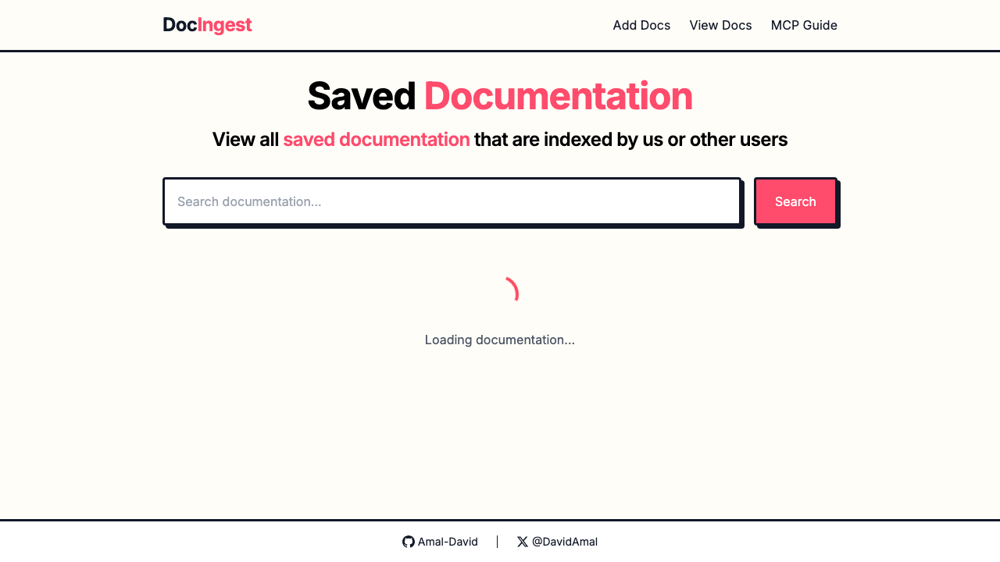
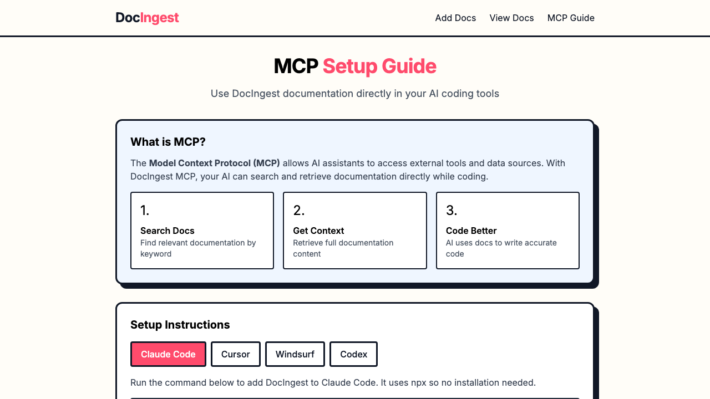

# DocIngest

DocIngest is the open-source engine for turning documentation sites into searchable, MCP-accessible context for humans and coding agents.

It crawls docs, extracts the useful content, stores it as clean markdown, indexes it for search, and exposes it through a web UI and an MCP server. You can self-host it, use it to build a public docs index, or wire it into tools like Claude Code, Cursor, Windsurf, and Codex.

## Screenshots

### Homepage


### Browse indexed docs



### MCP setup guide



## Why DocIngest

Most documentation is published for browsers, not for agents or retrieval systems.

DocIngest gives you a practical bridge:

- Crawl a docs site and keep the useful pages
- Store documentation in a simple file-based format
- Search across indexed libraries, frameworks, and APIs
- Expose the same corpus to humans in the UI and to agents through MCP
- Re-sync sources when upstream docs change

## What You Get

- Documentation crawling powered by Firecrawl
- Markdown-first storage for indexed pages
- Search and autocomplete across indexed docs
- Public or private self-hostable docs index
- MCP server for agent access to your documentation corpus
- Web UI for browsing, reading, and re-syncing docs

## Product Shape

DocIngest currently has three connected layers:

1. The ingestion engine
   Crawls documentation sites, extracts content, and stores it locally.
2. The searchable index
   Lets people browse and search indexed documentation from the web UI.
3. The MCP server
   Lets coding agents query the same docs corpus directly from AI tools.

That means you can treat DocIngest as:

- A self-hosted docs ingestion pipeline
- A searchable internal or public documentation index
- An MCP-ready context layer for coding agents

## Tech Stack

- Frontend: React + TypeScript + Tailwind CSS
- Backend: Node.js + Express + TypeScript
- Runtime: Bun or Node.js
- Crawling: Firecrawl API
- Storage: file-based markdown + metadata
- Production: PM2 + Nginx

## Quick Start

### Prerequisites

- Node.js 18+ or Bun
- A Firecrawl API key

### Install

```bash
git clone https://github.com/Amal-David/docingest.git
cd docingest
npm install
cd server && npm install && cd ..
```

### Configure

Create `.env` in the repo root:

```bash
FIRECRAWL_API_KEY=fc-your-api-key-here
REACT_APP_FIRECRAWL_API_URL=https://api.firecrawl.dev/v1
REACT_APP_API_URL=http://localhost:8001/api
```

### Run

Frontend:

```bash
npm run dev-start
```

Backend:

```bash
cd server
npm start
```

Then open `http://localhost:8000`.

## MCP Usage

DocIngest includes an MCP server so your coding tools can search and read indexed documentation.

Example:

```bash
claude mcp add docingest -- npx -y @docingest/mcp-server
```

You can adapt the same package for other MCP-compatible tools.

Core MCP capabilities:

- `find-docs` to locate a library or docs domain
- `read-docs` to fetch documentation content
- `query-docs` to run cross-doc full-text search

## Web App Usage

### Add documentation

1. Open the app
2. Paste a documentation URL
3. Set crawl options such as page limits or include/exclude patterns
4. Start the crawl
5. Save the extracted pages into the local docs index

### Browse indexed docs

- Search from the homepage
- Browse the indexed corpus from `/view`
- Open a specific docs domain from `/docs/:domain`
- Re-sync an indexed docs source when upstream content changes

## Storage Model

Indexed documentation is stored on disk:

```text
docingest/
├── server/storage/docs/
│   ├── example.com/
│   │   ├── documentation_2025-01-15T10:30:00.000Z.md
│   │   └── metadata.json
│   └── another-site.com/
│       ├── documentation_2025-01-16T14:20:00.000Z.md
│       └── metadata.json
```

This makes the corpus easy to inspect, back up, diff, and reuse.

## API Surface

Main routes:

- `GET /api/docs/list`
- `GET /api/docs/content`
- `GET /api/docs/download`
- `POST /api/docs/save`

The app also exposes crawl and admin endpoints used by the UI.

## Deployment

For production deployment guidance, see:

- [FIRECRAWL_SETUP.md](./FIRECRAWL_SETUP.md)
- [NGINX_SETUP.md](./NGINX_SETUP.md)
- [WEB_VITALS_SETUP.md](./WEB_VITALS_SETUP.md)

Typical production shape:

- React frontend build served behind Nginx
- Node/Express backend managed by PM2
- Firecrawl for external crawling
- Local markdown storage for the indexed corpus

## Open Source Direction

DocIngest is best understood as infrastructure for documentation retrieval:

- Useful on its own for humans
- More valuable when paired with coding agents
- Flexible enough for public indexes, internal corpora, and experiments

The hosted site at [docingest.com](https://docingest.com) can act as a public demo and discovery layer, while this repository remains the open-source engine underneath it.

## Contributing

Contributions are welcome, especially around:

- Better crawling and filtering
- Search quality and ranking
- MCP ergonomics
- Docs UX and browsing
- Self-hosting and deployment improvements

If you want to help, open an issue or start a discussion:

- [Issues](https://github.com/Amal-David/docingest/issues)
- [Discussions](https://github.com/Amal-David/docingest/discussions)

## License

MIT
